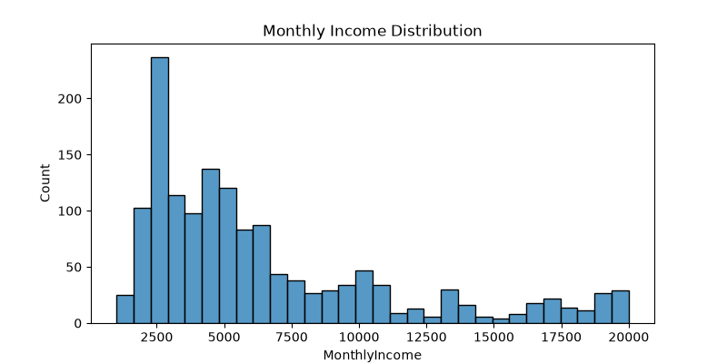

# HR Analytics Dashboard

## Overview

This project analyzes employee attrition using **SQL, Python, and Power BI**. The objective is to identify workforce trends, uncover the key drivers of employee attrition, and generate actionable business insights to support data-driven HR decision-making.

---

## Tools & Technologies

- SQL (MySQL)
- Python (Pandas, Matplotlib, Seaborn)
- Power BI
- Git & GitHub

---

## Dataset

**IBM HR Analytics Employee Attrition Dataset**

- **Total Records:** 1,470 Employees
- **Features:**
  - Employee Demographics
  - Department
  - Job Role
  - Monthly Income
  - Overtime
  - Attrition Status
  - Education
  - Job Satisfaction
  - Performance Rating
  - Workforce-related attributes

---

# Business Problem

Employee attrition increases recruitment costs, reduces productivity, and impacts organizational performance. This project analyzes HR data to identify the major factors contributing to employee attrition and provides insights that can help HR teams improve employee retention.

---

# Project Workflow

## 1. SQL Analysis

Performed SQL queries to analyze:

- Total Employees
- Attrition Count
- Attrition Rate
- Attrition by Department
- Attrition by Job Role
- Attrition by Overtime
- Salary Analysis
- Employee Demographics

### Sample SQL Query

```sql
SELECT
    Department,
    COUNT(*) AS Total_Employees,
    SUM(CASE WHEN Attrition='Yes' THEN 1 ELSE 0 END) AS Attrition_Count
FROM hr_employee_attrition
GROUP BY Department
ORDER BY Attrition_Count DESC;
```

---

## 2. Python Analysis

Performed Exploratory Data Analysis (EDA) using Python.

### Analysis Performed

- Data Validation
- Missing Value Analysis
- Attrition Trend Analysis
- Department Analysis
- Job Role Analysis
- Overtime Analysis
- Monthly Income Distribution
- Data Visualization using Matplotlib

---

## 3. Power BI Dashboard

Designed an interactive HR Analytics Dashboard containing:

### KPIs

- Total Employees
- Attrition Count
- Attrition Rate
- Average Monthly Income

### Dashboard Visualizations

- Attrition by Department
- Attrition by Job Role
- Attrition by Overtime
- Attrition by Gender
- Attrition by Age Group
- Monthly Income Distribution

---

# Dashboard Preview


---

# Monthly Income Distribution



---

# Key Insights

- Overall Attrition Rate: **16.12%**
- Employees working overtime showed significantly higher attrition.
- Research & Development and Sales departments experienced the highest employee turnover.
- Certain job roles exhibited noticeably higher attrition rates.
- Employees under 40 years of age accounted for the majority of attrition cases.

---

# Business Recommendations

- Reduce excessive overtime through better workforce planning.
- Improve employee engagement in Sales and Research & Development departments.
- Implement retention programs for high-risk job roles.
- Review compensation strategies for lower-income employees.
- Conduct regular employee satisfaction surveys.

---

# Project Structure

```
HR-Analytics-Dashboard
│
├── HR_Employee_Attrition_Cleaned.csv
├── hr_employee_attrition.csv
├── hr_analysis.py
├── hr_analysis_queries.sql
├── Power bi dashboard.pbix
├── dashboard .png
├── monthly_income_distribution.png
└── README.md
```

---

# Installation

Clone the repository

```bash
git clone https://github.com/YOUR_USERNAME/HR-Analytics-Dashboard.git
```

Navigate to the project directory

```bash
cd HR-Analytics-Dashboard
```

Install dependencies

```bash
pip install pandas matplotlib seaborn mysql-connector-python
```

Run the Python script

```bash
python hr_analysis.py
```

---

# Skills Demonstrated

- SQL Querying
- Data Cleaning
- Exploratory Data Analysis (EDA)
- Data Visualization
- Power BI Dashboard Development
- Business Intelligence
- Data Analytics
- Business Insights Generation

---

# Future Improvements

- Predict employee attrition using Machine Learning.
- Deploy dashboard using Power BI Service.
- Build an automated ETL pipeline.
- Add employee segmentation and forecasting.
- Integrate real-time HR data sources.

---

# Author

## Abhishek Kankatkar

**Aspiring Data Analyst**

### Skills

- SQL
- Python
- Power BI
- Excel
- Data Visualization
- Data Analytics

---

## Connect With Me

**GitHub:** https://github.com/YOUR_USERNAME

**LinkedIn:** https://www.linkedin.com/in/YOUR_LINKEDIN
