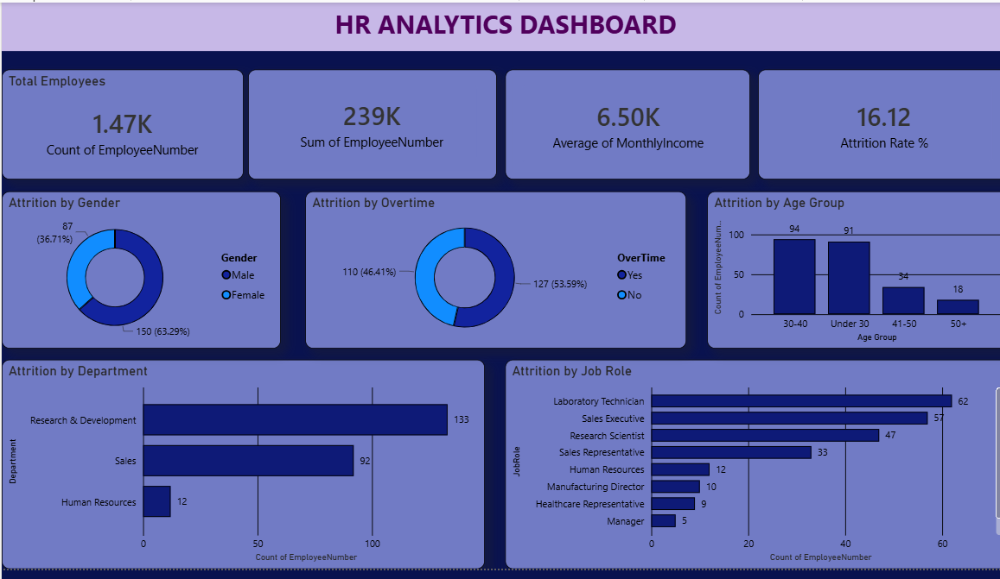
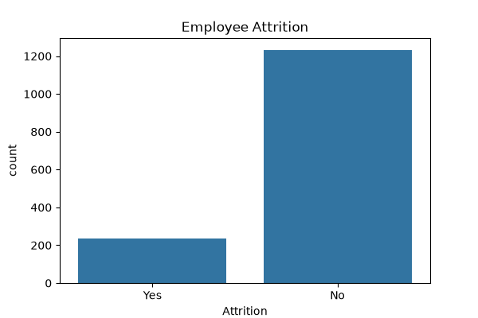
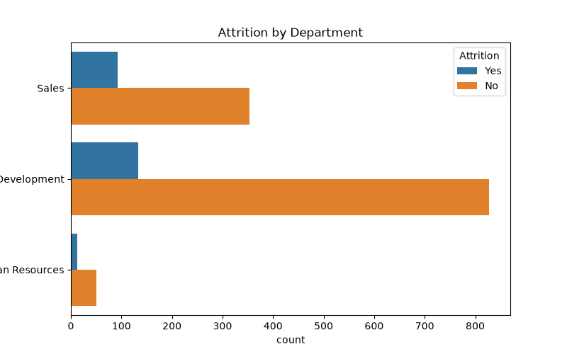
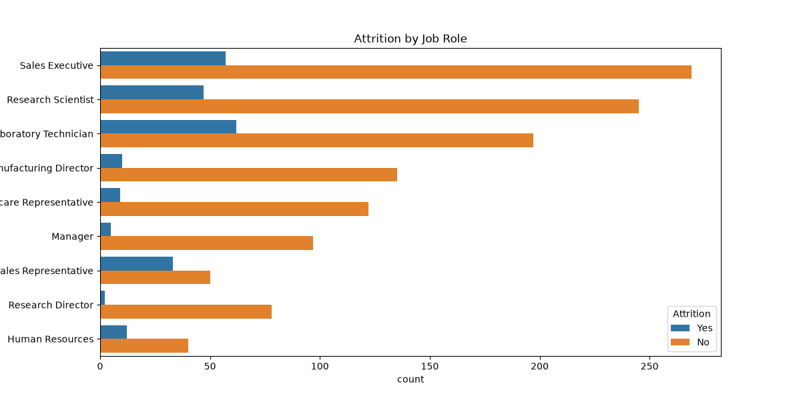
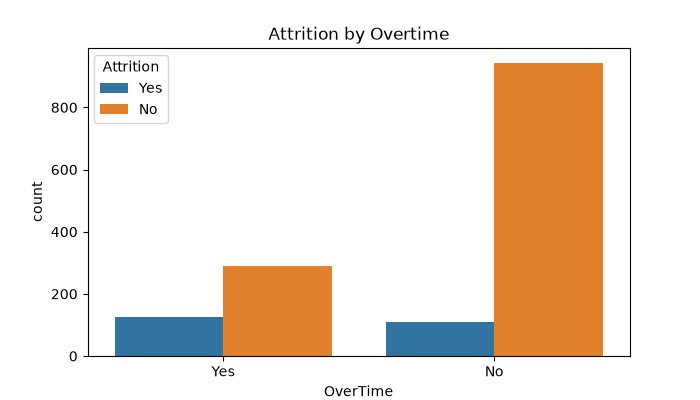
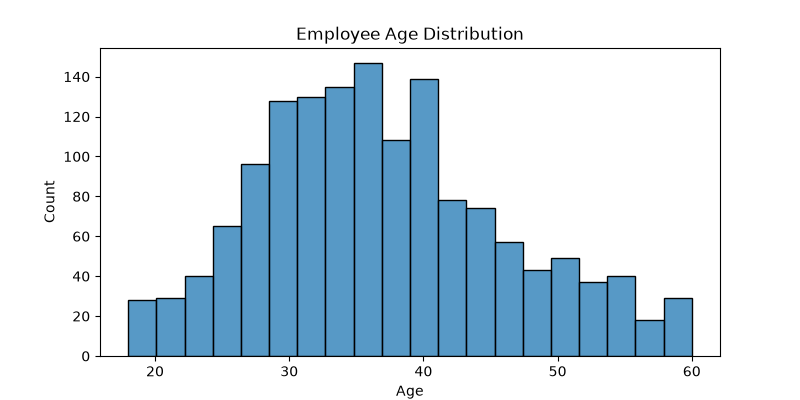

# HR Analytics Dashboard

## Overview

This project analyzes employee attrition using SQL, Python, and Power BI. The objective is to identify workforce trends, understand the key drivers of employee attrition, and generate actionable insights to support data-driven HR decision-making.

The project covers the complete analytics workflow, including data cleaning, SQL analysis, exploratory data analysis (EDA), and interactive dashboard development.

---

## Technologies Used

- SQL (MySQL)
- Python
- Pandas
- Matplotlib
- Seaborn
- Power BI
- Git & GitHub

---

## Dataset

**IBM HR Analytics Employee Attrition Dataset**

- Total Records: 1,470 Employees
- Features: Employee demographics, department, job role, salary, overtime, education, performance, job satisfaction, and attrition status.

---

## Project Workflow

### Data Preparation

- Validated the dataset
- Checked for missing values
- Cleaned and prepared the data for analysis

### SQL Analysis

Performed SQL queries to analyze:

- Total Employees
- Attrition Count
- Attrition Rate
- Department-wise Attrition
- Job Role Analysis
- Overtime Analysis
- Salary Analysis
- Workforce Demographics

#### Sample Query

```sql
SELECT
    Department,
    COUNT(*) AS TotalEmployees,
    SUM(CASE WHEN Attrition='Yes' THEN 1 ELSE 0 END) AS AttritionCount
FROM hr_employee_attrition
GROUP BY Department
ORDER BY AttritionCount DESC;
```

### Python Analysis

Performed exploratory data analysis using Python.

Analysis includes:

- Data Validation
- Missing Value Analysis
- Department Analysis
- Job Role Analysis
- Overtime Analysis
- Age Distribution
- Monthly Income Distribution
- Data Visualization using Matplotlib and Seaborn

### Power BI Dashboard

Developed an interactive dashboard containing:

**KPIs**

- Total Employees
- Attrition Count
- Attrition Rate
- Average Monthly Income

**Visualizations**

- Attrition by Department
- Attrition by Job Role
- Attrition by Overtime
- Attrition by Gender
- Attrition by Age Group
- Monthly Income Distribution

---

## Dashboard



---

## Python Visualizations

### Attrition Count



### Attrition by Department



### Attrition by Job Role



### Attrition by Overtime



### Age Distribution



### Monthly Income Distribution


---

## Key Insights

- The overall employee attrition rate is **16.12%**.
- Employees working overtime are significantly more likely to leave the organization.
- Research & Development and Sales departments have the highest attrition.
- Sales Executives and Laboratory Technicians experience comparatively higher turnover.
- Employees below the age of 40 account for the majority of attrition cases.
- Lower monthly income is associated with increased employee attrition.

---

## Business Recommendations

- Reduce excessive overtime through improved workforce planning.
- Strengthen employee engagement initiatives in high-attrition departments.
- Implement career development programs for high-risk job roles.
- Review compensation strategies for lower-income employees.
- Monitor employee satisfaction through regular feedback surveys.

---

## Project Structure

```
HR-Analytics-Dashboard/
│
├── HR_Employee_Attrition.csv
├── HR_Employee_Attrition_Cleaned.csv
├── hr_analysis.py
├── hr_analysis_queries.sql
├── HR_Analytics_Dashboard.pbix
├── dashboard.png
├── attrition_count.png
├── attrition_department.png
├── attrition_jobrole.png
├── attrition_overtime.png
├── age_distribution.png
├── monthly_income_distribution.png
├── README.md
└── requirements.txt
```

---

## Installation

Clone the repository.

```bash
git clone https://github.com/your-username/HR-Analytics-Dashboard.git
```

Navigate to the project directory.

```bash
cd HR-Analytics-Dashboard
```

Install the required packages.

```bash
pip install -r requirements.txt
```

Run the analysis.

```bash
python hr_analysis.py
```

---

## Skills Demonstrated

- SQL Querying
- Data Cleaning
- Exploratory Data Analysis (EDA)
- Data Visualization
- Dashboard Development
- Business Intelligence
- Power BI Reporting
- Data Analytics
- Business Insight Generation

---

## Future Enhancements

- Employee attrition prediction using machine learning
- Automated ETL pipeline
- Power BI Service deployment
- Employee segmentation
- Attrition forecasting

---

## Author

**Abhishek Kankatkar**

Aspiring Data Analyst

**Skills**

- SQL
- Python
- Power BI
- Excel
- Pandas
- Data Visualization

---


